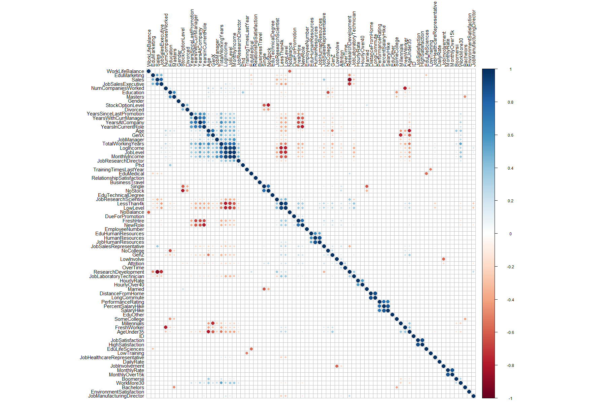

<center><h1>FritoLay Attrition Case Study</h1></center>


<hr>
#### Introduction:
* Steven Williams - CEO - FritoLay
* Jamie Caulfield - CFO - FritoLay


Thank you for allowing us the opportunity
to work with FritoLay on an analysis of your current employee management and attrition data.


#### About DDS Analytics: 
At DDS Analytics we specialize in talent management solutions for fortune 100 companies, 
specifically in the iterative process of developing and retaining employees. Our analytics and 
solutions may include workforce planning, employee training programs, identifying high-potential employees and 
reducing/preventing voluntary employee turnover(attrition). 


#### Attrition Defined: 
According to the 2021 bureau of labor statistics report, 25% of the turnover rate seen within the labor market
is due to voluntary turn over. As a general rule employee retention rates of 90% or higher are considered good, and a 
company should aim for a turnover rate of 10% or less. 
some of the general factors that attrition can be attributed to are:

* Lack of training and development
* Need for more flexible working hours
* Stage of Career
* Salary/Pay

The value in this venture for a company is multifaceted but can be realized in minimizing the expenses associated with cost-per-hires, ensuring internal projects are completed efficiently and on time, and promoting healthy relationships with external partners by keeping persons of contacts and relationships consistent over periods of time. 


<hr>
```{r setup, include=FALSE}
# not included in the print out
library(tidyverse)
library(janitor)
library(readxl)
library(GGally)
library(ggplot2)
library(treemapify)
library(gridExtra)
library(grid)
library(scales)
library(ggcorrplot)
library(corrplot)
library(class)
library(caret)
library(pROC)
library(e1071)
library(kableExtra)
library(StepReg)
library(ggthemes)
# READ IN DATA
data <- as.data.frame(read.csv("C:/Users/Joey/Desktop/project2/CaseStudy2-data.csv"))
vizdata <- as.data.frame(read.csv("C:/Users/Joey/Desktop/project2/CaseStudy2-data.csv"))
employee <- read.csv("C:/Users/Joey/Desktop/project2/CaseStudy2-data.csv", stringsAsFactors = T)

```
<center><h1>Exploratory Data Analysis</h1></center>
<hr>
#### Inspection of data:
Before working with the data, the first step in our process
is to get a snapshot of what types of variables we will be working with,
if there are any missing pieces of information, potential computer created errors 
based on the methods of data creation, and whether or not the data values themselves need intervention.
```{r import/tidy}
# glimpse(data)
# get_dupes(data)
# missing <- sapply(data, function(x) sum(is.na(x)))
# sum(missing)
# summary(data)
```
The data provided needs minimal or arguably no intervention. There does seem to be 
variables which may be interpreted and handled with some slight modifications which 
we will address shortly. 


#### Visualzing data and Relationships:
Before we begin to deep dive into any aspect of the data, DDS Analytics ops to engage in 
a visualization of the data, so that we can discover, and view different relationships that will help
us not only identify potential answers to explicit questions you may have but the visualizations may also serve 
as a catalyst to uncovering new questions and ideas we may not know exist.
```{r warning=FALSE, message=FALSE,results='hide', fig.align='center'}
#### Plotting Continuous Var Dist. of Data ####
cont_var <- vizdata %>% select(Attrition, Age, DistanceFromHome,
                            NumCompaniesWorked, PercentSalaryHike,TotalWorkingYears,
                            TrainingTimesLastYear,YearsAtCompany, YearsInCurrentRole,
                            YearsSinceLastPromotion,YearsWithCurrManager)

for (j in names(cont_var)) {
  plot_var_name <- str_c(c("ggplot",j), collapse ="_")
  print(plot_var_name)
  temp_plot <- ggplot(cont_var, aes_string(j,fill = 'Attrition')) +
    geom_bar(aes(y = ..count../sum(..count..)), position = "dodge", show.legend = FALSE)+
    scale_y_continuous(labels = percent_format()) +
    ylab("% of Attrition")
  assign(plot_var_name, temp_plot)
}
my_plots_list <- lapply(names(cont_var), function(j) {
  ggplot(cont_var, aes_string(j,fill = "Attrition")) +
    geom_bar(aes(y = ..count../sum(..count..)), position = "dodge", show.legend = FALSE) +
    scale_y_continuous(labels = percent_format()) +
    ylab("% of Attrition") +
    scale_color_fivethirtyeight("Attrition") +
    theme_hc()
})
my_plots_list[[1]] = NULL # to get rid of Attrition / Attrition Plot
gridExtra::grid.arrange(grobs= my_plots_list, ncol = 4)


#### Plotting Categorical Var Dist. of Data ####
cat_var <- vizdata %>% select(Attrition, JobSatisfaction, JobLevel, JobInvolvement,
                            StockOptionLevel, BusinessTravel, JobRole, EducationField,
                           Gender, MaritalStatus, Department,OverTime,
                            Education, RelationshipSatisfaction, WorkLifeBalance)
for (j in names(cat_var)) {
  plot_var_name <- str_c(c("ggplot",j), collapse ="_")
  print(plot_var_name)
  temp_plot <- ggplot(cat_var, aes_string(j,fill = 'Attrition')) +
    geom_bar(aes(y = ..count../sum(..count..)), position = "dodge", show.legend = F)+
    scale_y_continuous(labels = percent_format()) +
    ylab("% of Attrition")
  assign(plot_var_name, temp_plot)
}
my_plots_cat <- lapply(names(cat_var), function(j) {
  ggplot(cat_var, aes_string(j,fill = "Attrition"))+
    geom_bar(aes(y = ..count../sum(..count..)), color = "black", position = "dodge", show.legend = F)+
    scale_y_continuous(labels = percent_format()) +
    ylab("% of Attrition") +
    scale_color_fivethirtyeight("Attrition") +
    theme_hc()
})
my_plots_cat[[1]] = NULL # to get rid of Attrition / Attrition Plot
gridExtra::grid.arrange(grobs= my_plots_cat, ncol = 4)

```


#### Creating Variable Subcategories:
To intuitively interpret attrition within our visualizations, we created a "vizdata" data frame
which changes the "yes" or "no" logical status of attrition to "Left" or "Stayed". 


Additionally we have identified variables such as "Education Level" which is listed in a numerical format, and have changed it 
into Levels of "No College". "Some College", "Bachelors", "Masters", and "PhD". 
We will use this process with other variables such as Age, so that we can better understand different classifications of 
variable groups to help identify specific parties within the company.
```{r}
# CREATING INTUITIVE TITLE FOR VIZ OF DATA
vizdata$Attrition <- ifelse(vizdata$Attrition == "Yes", "Left", "Stayed")

data$EducationLevel <- ifelse(data$Education == 1, "No College",
                              ifelse(data$Education == 2, "Some College",
                                     ifelse(data$Education == 3, "Bachelors",
                                            ifelse(data$Education == 4, "Masters", "Phd"))))


vizdata$EducationLevel <- ifelse(data$Education == 1, "No College",
                              ifelse(data$Education == 2, "Some College",
                                     ifelse(data$Education == 3, "Bachelors",
                                            ifelse(data$Education == 4, "Masters", "Phd"))))


# Breaking Age into Generational Groups
data$Generations <- ifelse(data$Age > 26 & data$Age < 42, "Millennials",
                           ifelse(data$Age <= 26, "Gen Z",
                                  ifelse(data$Age >= 42 & data$Age <57, "Gen X",
                                         ifelse(data$Age >=57 & data$Age <= 67, "Boomers II",
                                                ifelse(data$Age >= 68, "Boomers I", 'Silent')))))

# Breaking Age into Generational Groups - VIZ DATA
vizdata$Generations <- ifelse(data$Age > 26 & data$Age < 42, "Millennials",
                           ifelse(data$Age <= 26, "Gen Z",
                                  ifelse(data$Age >= 42 & data$Age <57, "Gen X",
                                         ifelse(data$Age >=57 & data$Age <= 67, "Boomers II",
                                                ifelse(data$Age >= 68, "Boomers I", 'Silent')))))


```


#### Encoding Variables for Model Usage:
The data we are working with have many different categorical variables. One of the objectives of our work is
to create a predictive attrition model that utilizes the data we have to make predictions on future attrition. 
So that we can build an effective and efficient model, we will convert categorical data into numerical data by process of 
"One-Hot Encoding". 

One-Hot Encoding is simply the process of assigning replacement binary variables to categorical variables given in the data. 


#### Encoding variables and Feature Engineering for model use and investigations:
After Encoding and engineering new features to use in our investigation and modeling 
we will subset the data for columns that represent logical baseline reference points, and create a scaled data set to use for running the KNN prediction model.
```{r}
# CAT CODING BELOW:
data$Attrition <- ifelse(data$Attrition == "Yes",1,0)
data$OverTime <- ifelse(data$OverTime == "Yes",1,0)
data$Gender <- ifelse(data$Gender == "Male",1,0)
data$BusinessTravel <- as.numeric(factor(data$BusinessTravel, 
                                         levels=c("Non-Travel", "Travel_Rarely", "Travel_Frequently"))) -1
data$HumanResources <- ifelse(data$Department == "Human Resources",1,0)
data$ResearchDevelopment <- ifelse(data$Department == "Research & Development",1,0)
data$Sales <- ifelse(data$Department == "Sales",1,0)
data$Single <- ifelse(data$MaritalStatus == "Single",1,0)
data$Married <- ifelse(data$MaritalStatus == "Married",1,0)
data$Divorced <- ifelse(data$MaritalStatus == "Divorced",1,0)
data$EduHumanResources <- ifelse(data$EducationField == "Human Resources",1,0)
data$EduLifeSciences <- ifelse(data$EducationField == "Life Sciences",1,0)
data$EduMedical <- ifelse(data$EducationField == "Medical",1,0)
data$EduMarketing <- ifelse(data$EducationField == "Marketing",1,0)
data$EduTechnicalDegree <- ifelse(data$EducationField == "Technical Degree",1,0)
data$EduOther <- ifelse(data$EducationField == "Other",1,0)
data$JobSalesExecutive <- ifelse(data$JobRole == "Sales Executive",1,0)
data$JobResearchDirector <- ifelse(data$JobRole == "Research Director",1,0)
data$JobManufacturingDirector <- ifelse(data$JobRole == "Manufacturing Director",1,0)
data$JobResearchScientist <- ifelse(data$JobRole == "Research Scientist",1,0)
data$JobSalesExecutive <- ifelse(data$JobRole == "Sales Executive",1,0)
data$JobSalesRepresentative <- ifelse(data$JobRole == "Sales Representative",1,0)
data$JobManager <- ifelse(data$JobRole == "Manager",1,0)
data$JobHealthcareRepresentative <- ifelse(data$JobRole == "Healthcare Representative",1,0)
data$JobHumanResources <- ifelse(data$JobRole == "Human Resources",1,0)
data$JobLaboratoryTechnician <- ifelse(data$JobRole == "Laboratory Technician",1,0)
data$Bachelors <- ifelse(data$EducationLevel == 'Bachelors', 1, 0)
data$Masters <- ifelse(data$EducationLevel == "Masters", 1, 0)
data$SomeCollege <- ifelse(data$EducationLevel == "Some College", 1, 0)
data$NoCollege <- ifelse(data$EducationLevel == "No College", 1, 0)
data$Phd <- ifelse(data$EducationLevel == "Phd", 1, 0)
data$Millennials <- ifelse(data$Generations == "Millennials", 1, 0)
data$GenZ <- ifelse(data$Generations == "Gen Z", 1, 0)
data$GenX <- ifelse(data$Generations == "Gen X", 1, 0)
data$Boomersii <- ifelse(data$Generations == "Boomers II", 1, 0)

# NUMERICAL ENCODING BELOW:
data$LessThan4k <- ifelse(data$MonthlyIncome < 4000, 1, 0)
data$FreshWorker <- ifelse(data$NumCompaniesWorked <=1.25, 1, 0)
data$LowLevel <- ifelse(data$JobLevel == 1, 1, 0)
data$FreshHire <- ifelse(data$YearsAtCompany <=4, 1, 0) 
data$WorkMore30 <- ifelse(data$TotalWorkingYears >=30, 1, 0)
data$LowInvolve <- ifelse(data$JobInvolvement <2, 1, 0)
data$NewRole <- ifelse(data$YearsInCurrentRole <=2, 1, 0)
data$NoBalance <- ifelse(data$WorkLifeBalance <2, 1, 0)
data$SalaryHike <- ifelse(data$PercentSalaryHike  >17, 1, 0) 
data$HighSatisfaction <- ifelse(data$JobSatisfaction >= 3, 1, 0) 
data$LongCommute <- ifelse(data$DistanceFromHome >= 13, 1, 0)
data$AgeUnder35 <- ifelse(data$Age <=35, 1, 0) 
data$DueForPromotion <- ifelse(!data$YearsSinceLastPromotion %in% c(1,5,6,7), 1, 0) 
data$HighPerform <- ifelse(data$PerformanceRating >= 3, 1, 0) 
data$NoStock <- ifelse(data$StockOptionLevel < 1, 1 , 0)  
data$LowTraining <- ifelse(data$TrainingTimesLastYear < 2, 1, 0)
data$HourlyOver40 <- ifelse(data$HourlyRate > 40, 1, 0) 
data$MonthlyOver15k <- ifelse(data$MonthlyRate > 15000, 1, 0) 
data$LogIncome <- log(data$MonthlyIncome) 

```


#### Scaling Data:
The reason for scaling the data for the KNN model is because KNN uses Euclidean Distance to find similarities between observations.
To ensure a quality model we need to account for certain variables which may have a higher magnitude than others so that it is not biased towards those variables with higher magnitudes.
```{r}
# Factor Sub-setting for columns that represent logical baseline reference points from which the model will assume all included 
# predictor variables to deviate, and scaling data set for use in modeling
rdata <- subset(data, select = -c(Over18, Department, EducationLevel, 
                                  Generations, JobRole, MaritalStatus,
                                  EducationField, EmployeeCount,
                                  StandardHours))


# Scaling data for use in the KNN model 
scaled_data <- data.frame(apply(rdata, MARGIN = 2, FUN = function(X) (X - min(X))/diff(range(X))))

```


#### Visualizing Correlative Relationships
To fully understand attrition and its relationship to multiple variables we will create a correlation plot heat map. 
This heat map will illustrate which variables have a positive, neutral, or negative correlative relationship with attrition so that we can further explore each piece of data. 
```{r}
# this  tot_correlation will be used to plot the entire correlation matrix
tot_correlation <- subset(rdata, select = -c(HighPerform))
tot_correlation <- cor(tot_correlation)

# data_corr will be used to view a smaller scale of "core" var. 
data_corr <- cor(rdata %>% select(Age, Attrition,MonthlyIncome, DistanceFromHome,
                                  Education, NumCompaniesWorked, EnvironmentSatisfaction,
                                  Gender,HourlyRate, JobSatisfaction, PercentSalaryHike,
                                  OverTime, TotalWorkingYears, WorkLifeBalance, 
                                  YearsAtCompany:YearsWithCurrManager))

# this df will be used for analysis of Attrition and Salary data correlatives
crdata <- tot_correlation[,c("Attrition", "MonthlyIncome")]
crdata <- data.frame(rbind(names(crdata), crdata))
crdata <- tibble::rownames_to_column(crdata,"Feature")


# for use with core feats.
#crdata <- data_corr[,c("Attrition", "MonthlyIncome")]
#crdata <- data.frame(rbind(names(crdata), crdata))
#crdata <- tibble::rownames_to_column(crdata,"Feature")

# income correlations
IncomeCorrelation <- crdata %>% select(Feature, MonthlyIncome) %>%
  filter(!Feature %in% c("MonthlyIncome", "LogIncome")) %>%
  arrange(abs(MonthlyIncome))

# attrition correlations
AttritionCorrelation <- crdata %>% select(Feature, Attrition) %>% arrange(abs(Attrition)) %>% filter(Feature != "Attrition")
AttritionCorrelation$Feature <- as.factor(AttritionCorrelation$Feature)

```
<center>

</center>
<hr>
```{r include=FALSE}

# Corr Plot with Core Feature Selection
ggcorrplot(corr = data_corr, hc.order = TRUE,insig = 'blank',
           colors = c("#6D9EC1", "white", "#E46726")) +
  labs(title = "Correlation Between Variables and Attrition",
       subtitle = "Netural and Positive Correlation") +
  theme(plot.title = element_text(hjust = 0.5),
       plot.subtitle = element_text(hjust = 0.5))

# creating fun to generate the png plots to viz all feats. 
cor.mtest <- function(mat, ...) {
    mat <- as.matrix(mat)
    n <- ncol(mat)
    p.mat<- matrix(NA, n, n)
    diag(p.mat) <- 0
    for (i in 1:(n - 1)) {
        for (j in (i + 1):n) {
            tmp <- cor.test(mat[, i], mat[, j], ...)
            p.mat[i, j] <- p.mat[j, i] <- tmp$p.value
        }
    }
  colnames(p.mat) <- rownames(p.mat) <- colnames(mat)
  p.mat
}
# matrix of the p-value of the correlation
p.mat <- cor.mtest(tot_correlation)
col <- colorRampPalette(c("#BB4444", "#EE9988", "#FFFFFF", "#77AADD", "#4477AA"))
# Build corrNums.png
png(height=1200, width=1500, pointsize=8, file="./project2/CorNum.png")
corrplot(tot_correlation, method="color", col=col(200),  
         type="upper", order="hclust", 
         addCoef.col = "black", # Add coefficient of correlation
         tl.col="black", tl.srt=45, #Text label color and rotation
         # Combine with significance
         p.mat = p.mat, sig.level = 0.01, insig = "blank", tl.cex = 1.25,
         # hide correlation coefficient on the principal diagonal
         diag=FALSE 
         )
ggsave("./project2/CorNum.png", units="in", width=5, height=4, dpi=600)
dev.off()
# Build corrPlot.png
png(height=1200, width=1800, pointsize=15, file="./project2/CorPlot.png")
corrplot(tot_correlation, method="circle", order="hclust",tl.col="black", type="full", tl.cex = 1, p.mat = p.mat, sig.level = 0.01, insig = "blank")
ggsave("./project2/CorPlot.png", units="in", width=5, height=4, dpi=600)
dev.off()
# Build corrMixed.png
png(height=1200, width=1500, pointsize=10, file="./project2/CorMix.png")
corrplot.mixed(round(100*tot_correlation), number.cex = .75, tl.cex = 1, tl.pos = "lt",tl.col="black", is.corr=F)
ggsave("./project2/CorMix.png", units="in", width=5, height=4, dpi=600)
dev.off()

```

#### Correlative Ranking for Attrition and Income:
```{r warning=FALSE, message=FALSE,fig.align='center'}
AttritionCorrelation %>% top_n(10) %>% mutate(Feature = factor(Feature, Feature)) %>%
  ggplot(aes(Feature, Attrition, fill = Feature)) + geom_col(show.legend = FALSE) +
  coord_flip() + labs(title = "Top 10 Correlative Factors for Attrition") +
  ylab("Correlation for Feature and Attrition") +
  scale_fill_discrete(guide = guide_legend(reverse = TRUE))+
    scale_color_fivethirtyeight() +
    theme_hc()


IncomeCorrelation %>% top_n(10) %>% mutate(Feature = factor(Feature, Feature)) %>% 
  ggplot(aes(Feature, MonthlyIncome, fill = Feature)) + 
  geom_col(show.legend = FALSE) +
  labs(title = "Top 10 Correlative Factors for Monthly Income") +
  ylab("Correlation for Feature and Monthly Income") + coord_flip() +
    scale_color_fivethirtyeight() +
    theme_hc()


```

<hr>
<center>
  <h1>Question of Interest</h1>
    <h3>Identify The Top 3 Factors of Attrition and Monthly Income</h3> 
<center>
<hr>


#### Top 3 Factors of Attrition/Voluntary Turnover
* Over Time 
* No Stock Option
* Low Employee Level

Employees that fall into the Over Time category are those which are hourly employees.
The two other factors that follow make intuitive sense since stock options are
rarely given to hourly employees, and hourly employees tend to make up low level 
employees. 

```{r fig.align='center'}
# Plot for job Correlation based on the 10 ranks
job_corr <- cor(rdata %>% select(Attrition, OverTime, NoStock,
                                 LowLevel, JobSalesRepresentative,LowInvolve,
                                 LessThan4k, FreshHire,Single, NewRole,
                                 AgeUnder35))

# Job_Corr Plot with Core Feature Selection
ggcorrplot(corr = job_corr, hc.order = TRUE,insig = 'blank',lab = TRUE,
           lab_size = 2,
           colors = c("#6D9EC1", "white", "#E46726")) +
  labs(title = "Correlation Between Variables and Attrition",
       subtitle = "Netural and Positive Correlation") +
  theme(plot.title = element_text(hjust = 0.5),
       plot.subtitle = element_text(hjust = 0.5))

```


#### Top 3 Factors of Monthly Income
* Job Level
* Total Working Years
* Manager Job Level

Similar to the factors of Attrition, Job Level which holds rank 1 in our analysis
is followed by total working years, and manager job level, which both are variables 
that all make sense to be together intuitive.

```{r fig.align='center'}

# plot for income corr based on 10 ranks
income_corr <- cor(rdata %>% select(MonthlyIncome, JobLevel,TotalWorkingYears,
                                    JobManager,JobResearchDirector,YearsAtCompany,
                                    Age,GenX,WorkMore30,YearsInCurrentRole,YearsWithCurrManager))

# Corr Plot with Core Feature Selection
ggcorrplot(corr = income_corr, hc.order = TRUE,insig = 'blank',lab = TRUE,
           lab_size = 2,
           colors = c("#6D9EC1", "white", "#E46726")) +
  labs(title = "Correlation Between Variables and Attrition",
       subtitle = "Netural and Positive Correlation") +
  theme(plot.title = element_text(hjust = 0.5),
       plot.subtitle = element_text(hjust = 0.5))

```


#### Attrition for Specific Job Role:
Upon discovering the top factors that contribute to attrition at FritoLay,
we noticed the 4th rank to be the job role Sales Representative. 
This captured our interest and led us to ask the question "Which job roles are seeing
the most amount of attrition?"

Asking this question helped to uncover the top 3 job roles in which FritoLay is 
experiencing the greatest percentage of turnover within each role.
* Sales Representative - 45.28% of the individuals in this role left.
* Human Resources - 22.22% of the individuals in this role left.
* Laboratory Technicians - 19.61% of the individuals in this role left.

As you may recall, the 2021 bureau of labor statistics report, 25% of the turnover rate seen within the labor market
is due to voluntary turn over. As a general rule employee retention rates of 90% or higher are considered good, and a 
company should aim for a turnover rate of 10% or less.

Based on these numbers, the Sales Representative position is well above the typical 25% turnover rate within the labor market.
Additionally, the Human Resources and Laboratory Technicians roles are each nearly double the ideal turnover rate of 10% or less. 
```{r fig.align='center'}
# creating a DF that shows the COUNT of ATTRITION for each role
churn_jr <- as.data.frame(vizdata %>% count(JobRole, Attrition))

# Creating a DF that has PERCENT of LEAVE/STAY for each Job Role
churn_percent_jr <- 
  as.data.frame(churn_jr %>% group_by(JobRole) %>%
                  mutate(Percentage = paste0(round(n/sum(n)*100,2))))

churn_percent_jr$Percentage <- as.numeric(churn_percent_jr$Percentage)

# Tree map of Employees that leave per Job Role
churn_percent_jr %>% 
  filter(Attrition == "Left") %>%
  ggplot(aes(area = Percentage, fill = JobRole, label = paste(JobRole, "\n",Percentage,"%")))+
  geom_treemap(show.legend = FALSE, color = 'black') +
  geom_treemap_text(color = 'white', place = "center") +
  ggtitle('Percentage of Attrition Within Each Job Role') + 
  theme(plot.title = element_text(hjust = .5))
  
```


Area of Opportunity by - Job Roles

```{r fig.align='center'}
# raw amount of individuals with certain degrees:
#vizdata %>% select(EducationField) %>%
 # ggplot(aes(EducationField, fill = EducationField)) +
  #geom_bar(show.legend = F) + coord_flip() +
  #ggtitle("Number of Employees with Various Education Fields")

# creating a DF that shows the COUNT of ATTRITION for Education Field
churn_ef <- as.data.frame(vizdata %>% count(EducationField, Attrition))

# Creating a DF that has PERCENT of LEAVE/STAY for each Job Role
churn_percent_ef <- 
  as.data.frame(churn_ef %>% group_by(EducationField) %>%
                  mutate(Percentage = paste0(round(n/sum(n)*100,2))))

churn_percent_ef$Percentage <- as.numeric(churn_percent_ef$Percentage)


# Tree map of Employees that leave per Education Field
churn_percent_ef %>% 
  filter(Attrition == "Left") %>%
  ggplot(aes(area = Percentage, fill = EducationField, label = paste(EducationField, "\n",Percentage,"%")))+
  geom_treemap(show.legend = FALSE,  color = "black") +
  geom_treemap_text(color = 'white', place = "center") +
  ggtitle('Percentage of Attrition Within Each Degree Type')

```


Matching Degree type to Job Role and age generation
```{r fig.align='center'}
# Degree type within each JobRole
vizdata %>% select(EducationField, JobRole) %>%
  group_by(EducationField, JobRole) %>%
  summarize(n = n()) %>%
  ggplot(aes(x = fct_reorder(EducationField, n), y = n, fill = EducationField)) +
  geom_bar(stat = "identity") + facet_wrap(.~JobRole) +
  theme(axis.text.x = element_blank(), axis.ticks.x = element_blank())


#vizdata %>% select(EducationField, Generations) %>%
 # group_by(EducationField, Generations) %>%
  #summarize(n = n()) %>%
  #ggplot(aes(x = fct_reorder(EducationField, n), y = n, fill = EducationField)) +
  #geom_bar(stat = "identity") + facet_wrap(.~Generations) +
  #theme(axis.text.x = element_blank(), axis.ticks.x = element_blank())
  
# age groups within each jobrole
vizdata %>% select(Generations, JobRole) %>%
  group_by(Generations, JobRole) %>%
  summarize(n = n()) %>%
  ggplot(aes(x = fct_reorder(Generations, n), y = n, fill = Generations)) +
  geom_bar(stat = "identity") + facet_wrap(.~JobRole) +
  theme(axis.text.x = element_blank(), axis.ticks.x = element_blank())

#vizdata %>% select(MonthlyIncome, Generations, JobRole) %>%
 # ggplot(aes(MonthlyIncome, Generations, fill = Generations)) +
  #geom_boxplot(show.legend = FALSE) + 
  #coord_flip() + 
  #facet_wrap(.~JobRole)

```


<hr>
<center><h1>Predictive Models for Attrition</h1></center>
<hr>


#### Naive Bayes
Summary: 

Results:
```{r fig.align='center'}
iterations = 100
masterAcc_nb = matrix(nrow = iterations)
masterSpec_nb = matrix(nrow = iterations)
masterSen_nb = matrix(nrow = iterations)
splitPerc <- .7

nbArray <- c("OverTime","NewRole", "WorkLifeBalance", "JobInvolvement",
             "JobSatisfaction", "Gender", "EnvironmentSatisfaction",
             "BusinessTravel", "MonthlyIncome", "FreshHire", "AgeUnder35",
             "LogIncome", "Divorced", "HourlyOver40", "NoStock","HighPerform")


for(j in 1:iterations){
  trainIndices = sample(1:dim(data)[1],round(splitPerc * dim(data)[1]))
  train = data[trainIndices,]
  test = data[-trainIndices,]
  model = naiveBayes(train[,nbArray],as.factor(train$Attrition))
  CM_NB = confusionMatrix(table(predict(model,test[,nbArray]),as.factor(test$Attrition), dnn = c("Prediction", "Reference")), positive = '1')
  masterAcc_nb[j] = CM_NB$overall[1]
  masterSen_nb[j] = CM_NB$byClass[1]
  masterSpec_nb[j] = CM_NB$byClass[2]
}

# function for plotting confusion matrix
ggplotConfusionMatrix_nb <- function(m){
  p <- ggplot(data= as.data.frame(m$table),
              aes(x = Reference, y = Prediction)) +
    geom_tile(aes(fill = log(Freq)), color = "white") +
    scale_fill_gradient(low = "white", high = "steelblue") +
    geom_text(aes(x = Reference, y = Prediction, label = Freq)) +
    theme(legend.position = 'none') +
    ggtitle("Confusion Matrix for Naive Bayes Model")
  return(p)
}


ggplotConfusionMatrix_nb(CM_NB)  
  
#confusionMatrix(table(predict(model,test[,nbArray]), as.factor(test$Attrition),
 #                     dnn = c("Prediction", "Reference")), positive = '1')

#specs_nb <- c(colMeans(masterAcc),colMeans(masterSen),colMeans(masterSpec))

#names(specs_nb) <- c("Avg Accuracy", "Avg Sensitivity", "Avg Specificity")
#specs_nb
```


```{r include=FALSE}
# code for using selection model, and trying regression for var selection. 
#set.seed(7)
#splitPerc = .7
#trainIndices = sample(1:dim(rdata)[1],round(splitPerc * dim(rdata)[1]))
#train = rdata[trainIndices,]
#test = rdata[-trainIndices,]
#lreg <- glm(formula = Attrition ~ .,
 #             data= rdata, family="binomial")
#used the following for the knn model 
#lreg <- lm(formula = Attrition ~ .,
              #data= rdata)

# using the selected models from forward selection:
#lreg <- lm(formula = Attrition ~OverTime+NoStock+LowLevel+LowInvolve+Sales+JobSatisfaction+
 #             NoBalance+LongCommute+JobInvolvement+NumCompaniesWorked+AgeUnder35+
  #            BusinessTravel+RelationshipSatisfaction+YearsSinceLastPromotion+EnvironmentSatisfaction+
   #           FreshHire+JobHealthcareRepresentative, data = rdata)

#atPrd <- predict(lreg, type="response", newdata = test)
#actualPred <- ifelse(atPrd > 0.5, 1, 0)
#confusionMatrix(table(as.factor(actualPred), as.factor(test$Attrition),
 #                     dnn = c("Prediction", "Reference")), positive = '1')

#plot(roc(response = lreg$y, predictor = lreg$
  #         fitted.values, plot = T), print.thres = "best", print.auc = T)

#ols_step_forward_p(lreg, penter = .05, details = TRUE)


```


#### K Nearest Neighbor
Summary:

Results:
```{r fig.align='center', warning=FALSE}
iterations = 50
set.seed(7)
numks = round(sqrt(dim(scaled_data)[1])*1.2)
masterAcc = matrix(nrow = iterations, ncol = numks)
masterSpec= matrix(nrow = iterations, ncol = numks)
masterSen = matrix(nrow = iterations, ncol = numks)
# standard explore: avg - 86 / 76.8 / 86.6 / 78
#knnVar <- c("OverTime", "Single", "JobSalesRepresentative", 
 #             "LessThan4k", "FreshWorker",
  #            "LowLevel", "FreshHire", "LowInvolve", "NewRole", "NoBalance",
   #           "AgeUnder35", "NoStock","JobSatisfaction","WorkLifeBalance",
    #          "JobInvolvement","DueForPromotion","DistanceFromHome",
     #         "MonthlyIncome")

# top 10 : avg - 85.9 / 78 / 86 / 79
knnVar <- c("OverTime","NoStock","LowLevel","JobSalesRepresentative",
              "LowInvolve","LessThan4k","FreshHire","Single","NewRole",
              "AgeUnder35")

# the following is for forward model selection 85/67/86 
#knnVar <- c("OverTime", "NoStock","LowLevel", "LowInvolve","Sales", "JobSatisfaction",
         #     "NoBalance", "LongCommute","JobInvolvement","NumCompaniesWorked","AgeUnder35",
          #    "BusinessTravel","RelationshipSatisfaction","YearsSinceLastPromotion","EnvironmentSatisfaction",
           #  "FreshHire","JobHealthcareRepresentative")

for(j in 1:iterations) {
  trainIndices = sample(1:dim(scaled_data)[1],round(splitPerc * dim(scaled_data)[1]))
  train = scaled_data[trainIndices,]
  test = scaled_data[-trainIndices,]
  for(i in 1:numks) {
    # predict using i-th value of k
    classifications = knn(train[,knnVar],test[,knnVar],as.factor(train$Attrition), prob = TRUE, k = i)
    CM= confusionMatrix(table(as.factor(test$Attrition),classifications, dnn = c("Prediction", "Reference")), positive = '1')
    masterAcc[j,i] = CM$overall[1]
    masterSen[j,i] = CM$byClass[1]
    masterSpec[j,i] = ifelse(is.na(CM$byClass[2]),0,CM$byClass[2])
  }
}
MeanAcc <- colMeans(masterAcc)
MeanSen <- colMeans(masterSen)
MeanSpec <- colMeans(masterSpec)
plot(seq(1,numks), MeanAcc, main="K value determination", xlab="Value of K")

#which.max(MeanAcc) # suggested k for best accuracy
#which.max(MeanSen)
#which.max(MeanSpec)

k <- which.max(MeanAcc)
specs <- c(MeanAcc[k], MeanSen[k], MeanSpec[k])
names(specs) <- c("Avg Acc", "Avg Sen", "Avg Spec")
specs

classifications = knn(train[,knnVar],test[,knnVar],as.factor(train$Attrition), prob = TRUE, k = k)
#confusionMatrix(table(test$Attrition,classifications, dnn = c("Prediction", "Reference")), positive = '1')

#attributes(classifications)$prob


#roc(test$Attrition, attributes(classifications)$prob)

plot(roc(test$Attrition, attributes(classifications)$prob),
     print.thres = T,
     print.auc=T)

u <-union(classifications,test[,knnVar])
t <- table(factor(classifications,u), factor(test$Attrition,u), dnn = c("Prediction", "Reference"))
CMP <- confusionMatrix(t)

cat("Accuracy:", CM$overall[1]*100, "%",
    "\nSensitivity:",CM$byClass[1]*100, "%",
    "\nSpecificity:",CM$byClass[2]*100, "%")

knn_plot <- as.data.frame(CM$table)

knn_plot$Prediction <- factor(knn_plot$Prediction, levels = rev(levels(knn_plot$Reference)))

ggplot(knn_plot, aes(Prediction, Reference, fill=(Freq))) +
  geom_tile(show.legend = FALSE) + geom_text(aes(label=(Freq))) +
  scale_fill_gradient(low = "white", high = "steelblue") +
  labs(x = "Reference", y = "Prediction")

```


<hr>
<center><h1>Predictive Model for Income</h1></center>
<hr>

Visualizing relationships of the selected Variables 
```{r warning=FALSE, message=FALSE, fig.align='center'}
data %>% select('MonthlyIncome','JobLevel','TotalWorkingYears','JobRole') %>%
  ggpairs(title = "Correlation for Monthly Income using Linear Regression Features", aes(color= "blue"), color = "blue")

```


#### Linear Regression for Monthly Income
Summary:

Results:
```{r}
set.seed(7)
trainIndices = sample(1:dim(rdata)[1],round(splitPerc * dim(rdata)[1]))
train = data[trainIndices,]
test = data[-trainIndices,]
salFit <- lm(MonthlyIncome ~ 
               JobLevel +
               TotalWorkingYears +
               JobRole, data=train)
summary(salFit)
salPrd <- predict(salFit, interval="predict",newdata = test)
RMSE <- sqrt(mean((salPrd[,1] - test$MonthlyIncome)^2))
RMSE

```

<hr>
<center><h1>Conclusion</h1><center>
<hr>