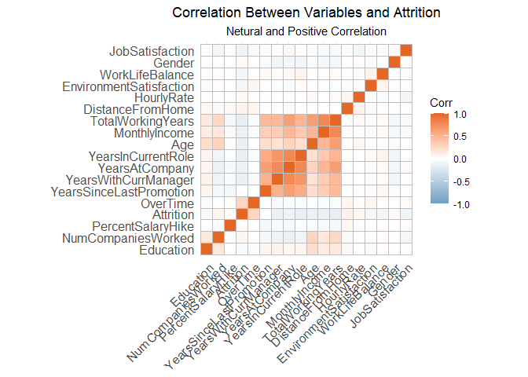
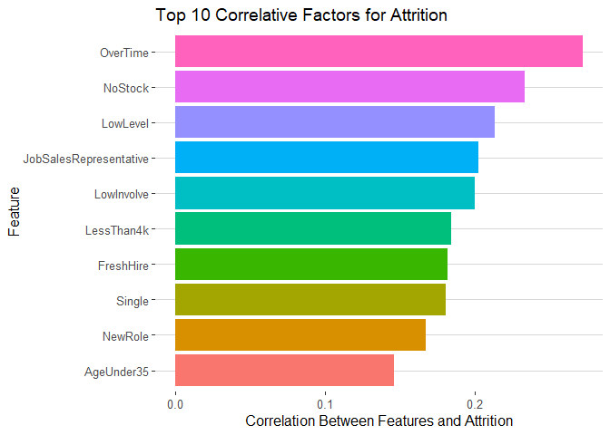
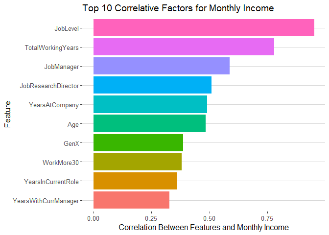
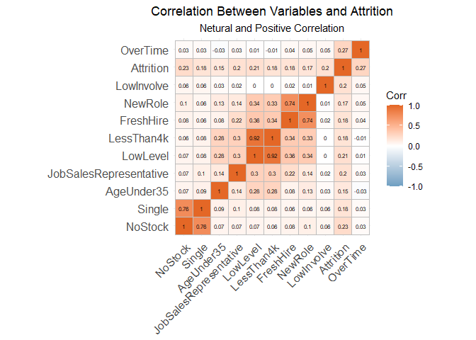
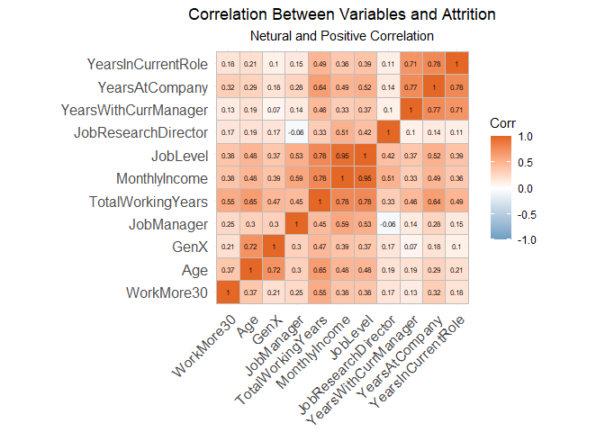
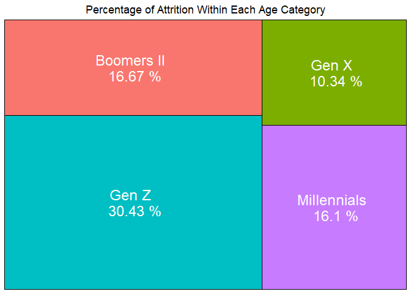
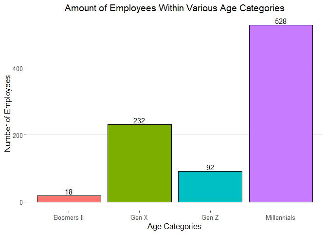
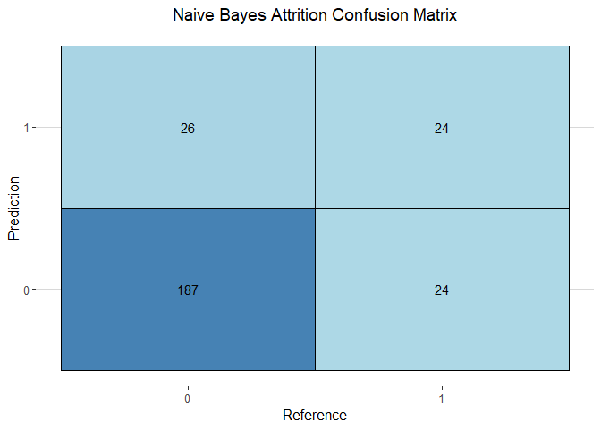

Attrition Project
================
Joey Hernandez
2022-11-25

## Introduction:

Steven Williams - CEO Jamie Caulfield - CFO Thank you Jamie Caulfield -
CFO, and Steven Williams for allowing us the opportunity to work with
FritoLay on an analysis of your existing employee management and
atrrition performance.

# About DDS Analytics

At DDS Analytics we specialize in talent managment solutions for fortune
100 companies, specifically in the iterative process of developing and
retaining employees. Our analytics and solutions may include workforce
planning, employee training programs, identifying high-potential
employees and reducing/preventing voluntary employee
turnover(attrition).

# Attrition Defined

According to the 2021 bureau of labor statistics report, 25% of the
turnover rate seen within the labor market is due to voluntary turn
over. As a general rule employee retention rates of 90% or higher are
considered good, and a company should aim for a turnover rate of 10% or
less. some of the general factors that attrition can be attributed to
are: - lack of training and development - Poor communication between
management - Inadequate staffing levels to cover the workload - Lack of
recognition - inability to provide feedback - need for more flexible
working hours

additional factors are: Gender Age

The value in this venture for a company is multifaceted but can be
realized in minimizing the expeneses of cost-per-hires, ensuring
internal projects are completed efficiently and on time, and promoting
healthy relationships with external partners by keeping persons of
contacts consistent over long periods of time.

Inspection of data : Before working with the data, we like to get a
snapshot of what types of variables we have, if there are any missing
pieces of information, or potential computer created errors based on the
methods of data creation. We have fortunatley been given a great dataset
that needed minimal intervention. there was no found missing pieces, or
visble errors.

``` r
# glimpse(data)
# get_dupes(data)
# missing <- sapply(data, function(x) sum(is.na(x)))
# sum(missing)
# summary(data)
```

# subcategories

We will create subcategories of factors for helpful investigation as
well as for use in our predictive models.

``` r
# CREATING INTUITIVE TITLE FOR VIZ OF DATA
vizdata$Attrition <- ifelse(vizdata$Attrition == "Yes", "Left", "Stayed")

data$EducationLevel <- ifelse(data$Education == 1, "No College",
                              ifelse(data$Education == 2, "Some College",
                                     ifelse(data$Education == 3, "Bachelors",
                                            ifelse(data$Education == 4, "Masters", "Phd"))))


vizdata$EducationLevel <- ifelse(data$Education == 1, "No College",
                              ifelse(data$Education == 2, "Some College",
                                     ifelse(data$Education == 3, "Bachelors",
                                            ifelse(data$Education == 4, "Masters", "Phd"))))


# Breaking Age into Generational Groups
data$Generations <- ifelse(data$Age > 26 & data$Age < 42, "Millennials",
                           ifelse(data$Age <= 26, "Gen Z",
                                  ifelse(data$Age >= 42 & data$Age <57, "Gen X",
                                         ifelse(data$Age >=57 & data$Age <= 67, "Boomers II",
                                                ifelse(data$Age >= 68, "Boomers I", 'Silent')))))

# Breaking Age into Generational Groups - VIZ DATA
vizdata$Generations <- ifelse(data$Age > 26 & data$Age < 42, "Millennials",
                           ifelse(data$Age <= 26, "Gen Z",
                                  ifelse(data$Age >= 42 & data$Age <57, "Gen X",
                                         ifelse(data$Age >=57 & data$Age <= 67, "Boomers II",
                                                ifelse(data$Age >= 68, "Boomers I", 'Silent')))))
```

# Encoding variables for future model use and further investigations:

``` r
# CAT CODING BELOW:
data$Attrition <- ifelse(data$Attrition == "Yes",1,0)
data$OverTime <- ifelse(data$OverTime == "Yes",1,0)
data$Gender <- ifelse(data$Gender == "Male",1,0)
data$BusinessTravel <- as.numeric(factor(data$BusinessTravel, 
                                         levels=c("Non-Travel", "Travel_Rarely", "Travel_Frequently"))) -1
data$HumanResources <- ifelse(data$Department == "Human Resources",1,0)
data$ResearchDevelopment <- ifelse(data$Department == "Research & Development",1,0)
data$Sales <- ifelse(data$Department == "Sales",1,0)
data$Single <- ifelse(data$MaritalStatus == "Single",1,0)
data$Married <- ifelse(data$MaritalStatus == "Married",1,0)
data$Divorced <- ifelse(data$MaritalStatus == "Divorced",1,0)
data$EduHumanResources <- ifelse(data$EducationField == "Human Resources",1,0)
data$EduLifeSciences <- ifelse(data$EducationField == "Life Sciences",1,0)
data$EduMedical <- ifelse(data$EducationField == "Medical",1,0)
data$EduMarketing <- ifelse(data$EducationField == "Marketing",1,0)
data$EduTechnicalDegree <- ifelse(data$EducationField == "Technical Degree",1,0)
data$EduOther <- ifelse(data$EducationField == "Other",1,0)
data$JobSalesExecutive <- ifelse(data$JobRole == "Sales Executive",1,0)
data$JobResearchDirector <- ifelse(data$JobRole == "Research Director",1,0)
data$JobManufacturingDirector <- ifelse(data$JobRole == "Manufacturing Director",1,0)
data$JobResearchScientist <- ifelse(data$JobRole == "Research Scientist",1,0)
data$JobSalesExecutive <- ifelse(data$JobRole == "Sales Executive",1,0)
data$JobSalesRepresentative <- ifelse(data$JobRole == "Sales Representative",1,0)
data$JobManager <- ifelse(data$JobRole == "Manager",1,0)
data$JobHealthcareRepresentative <- ifelse(data$JobRole == "Healthcare Representative",1,0)
data$JobHumanResources <- ifelse(data$JobRole == "Human Resources",1,0)
data$JobLaboratoryTechnician <- ifelse(data$JobRole == "Laboratory Technician",1,0)
data$Bachelors <- ifelse(data$EducationLevel == 'Bachelors', 1, 0)
data$Masters <- ifelse(data$EducationLevel == "Masters", 1, 0)
data$SomeCollege <- ifelse(data$EducationLevel == "Some College", 1, 0)
data$NoCollege <- ifelse(data$EducationLevel == "No College", 1, 0)
data$Phd <- ifelse(data$EducationLevel == "Phd", 1, 0)
data$Millennials <- ifelse(data$Generations == "Millennials", 1, 0)
data$GenZ <- ifelse(data$Generations == "Gen Z", 1, 0)
data$GenX <- ifelse(data$Generations == "Gen X", 1, 0)
data$Boomersii <- ifelse(data$Generations == "Boomers II", 1, 0)

# NUMERICAL ENCODING BELOW:
data$LessThan4k <- ifelse(data$MonthlyIncome < 4000, 1, 0)
data$FreshWorker <- ifelse(data$NumCompaniesWorked <=1.25, 1, 0)
data$LowLevel <- ifelse(data$JobLevel == 1, 1, 0)
data$FreshHire <- ifelse(data$YearsAtCompany <=4, 1, 0) 
data$WorkMore30 <- ifelse(data$TotalWorkingYears >=30, 1, 0)
data$LowInvolve <- ifelse(data$JobInvolvement <2, 1, 0)
data$NewRole <- ifelse(data$YearsInCurrentRole <=2, 1, 0)
data$NoBalance <- ifelse(data$WorkLifeBalance <2, 1, 0)
data$SalaryHike <- ifelse(data$PercentSalaryHike  >17, 1, 0) 
data$HighSatisfaction <- ifelse(data$JobSatisfaction >= 3, 1, 0) 
data$LongCommute <- ifelse(data$DistanceFromHome >= 13, 1, 0)
data$AgeUnder35 <- ifelse(data$Age <=35, 1, 0) 
data$DueForPromotion <- ifelse(!data$YearsSinceLastPromotion %in% c(1,5,6,7), 1, 0) 
data$HighPerform <- ifelse(data$PerformanceRating >= 3, 1, 0) 
data$NoStock <- ifelse(data$StockOptionLevel < 1, 1 , 0)  
data$LowTraining <- ifelse(data$TrainingTimesLastYear < 2, 1, 0)
data$HourlyOver40 <- ifelse(data$HourlyRate > 40, 1, 0) 
data$MonthlyOver15k <- ifelse(data$MonthlyRate > 15000, 1, 0) 
data$LogIncome <- log(data$MonthlyIncome) 
```

Factor Subsetting for columns that represent logical baseline refernece
points from which the model will assume all included predictor variables
to deviate, and scaling dataset for use in modeling

``` r
rdata <- subset(data, select = -c(Over18, Department, EducationLevel, 
                                  Generations, JobRole, MaritalStatus,
                                  EducationField, EmployeeCount,
                                  StandardHours))
# Scaling Data for KNN Performance 
scaled_data <- data.frame(apply(rdata, MARGIN = 2, FUN = function(X) (X - min(X))/diff(range(X))))
```

creating a correlation to visualize

``` r
data_corr <- cor(rdata %>% select(Age, Attrition,MonthlyIncome, DistanceFromHome,
                                  Education, NumCompaniesWorked, EnvironmentSatisfaction,
                                  Gender,HourlyRate, JobSatisfaction, PercentSalaryHike,
                                  OverTime, TotalWorkingYears, WorkLifeBalance, 
                                  YearsAtCompany:YearsWithCurrManager))

crdata <- data_corr[,c("Attrition", "MonthlyIncome")]
crdata <- data.frame(rbind(names(crdata), crdata))
crdata <- tibble::rownames_to_column(crdata,"Feature")
```

Visualizing Correlations in the Data Features/Variables

``` r
IncomeCorrelation <- crdata %>% select(Feature, MonthlyIncome) %>%
  filter(!Feature %in% c("MonthlyIncome", "LogIncome")) %>%
  arrange(abs(MonthlyIncome))


AttritionCorrelation <- crdata %>% select(Feature, Attrition) %>% arrange(abs(Attrition)) %>% filter(Feature != "Attrition")
AttritionCorrelation$Feature <- as.factor(AttritionCorrelation$Feature)

ggcorrplot(corr = data_corr, hc.order = TRUE,insig = 'blank',
           lab = TRUE, lab_size = 3, colors = c("#6D9EC1", "white", "#E46726"))+
  labs(title = "Correlation Between Variables and Attrition",
       subtitle = "Netural and Positive Correlation") +
  theme(plot.title = element_text(hjust = 0.5),
        plot.subtitle = element_text(hjust = 0.5))
```

<!-- -->

# Top 3 Factors of Attrition/Turnover

Over-Time, No Stock, Business Travel \* correlation and p-values

Locating where Attrition is hurting: \# Job role specific trends

# Interesting Trends / Observations

Area of Opportunity by - Job Roles

``` r
# creating a DF that shows the COUNT of ATTRITION for each role
churn_jr <- as.data.frame(vizdata %>% count(JobRole, Attrition))

# Creating a DF that has PERCENT of LEAVE/STAY for each Job Role
churn_percent_jr <- 
  as.data.frame(churn_jr %>% group_by(JobRole) %>%
                  mutate(Percentage = paste0(round(n/sum(n)*100,2))))

churn_percent_jr$Percentage <- as.numeric(churn_percent_jr$Percentage)

# Tree map of Employees that leave per Job Role
churn_percent_jr %>% 
  filter(Attrition == "Left") %>%
  ggplot(aes(area = Percentage, fill = JobRole, label = paste(JobRole, "\n",Percentage,"%")))+
  geom_treemap(show.legend = FALSE, color = 'black') +
  geom_treemap_text(color = 'white', place = "center") +
  ggtitle('Percentage of Attrition Within Each Job Role') + 
  theme(plot.title = element_text(hjust = .5))
```

<!-- -->

# Interesting Trends / Observations

Area of Opportunity by - Age Generations

``` r
# What NUMBER of People Stay within each age
vizdata %>% select(Generations, Attrition) %>%
  ggplot(aes(Generations, fill = Generations)) +
  geom_bar(position = "dodge", show.legend = FALSE) +
  ggtitle("Title") + 
  facet_wrap(Attrition~.)
```

<!-- -->

``` r
# creating a DF that shows the COUNT of ATTRITION for age
churn_Gen <- as.data.frame(vizdata %>% count(Generations, Attrition))
churn_Gen
```

    ##   Generations Attrition   n
    ## 1  Boomers II      Left   3
    ## 2  Boomers II    Stayed  15
    ## 3       Gen X      Left  24
    ## 4       Gen X    Stayed 208
    ## 5       Gen Z      Left  28
    ## 6       Gen Z    Stayed  64
    ## 7 Millennials      Left  85
    ## 8 Millennials    Stayed 443

``` r
# Creating a DF that has PERCENT of LEAVE/STAY for each age
churn_percent_Gen <- 
  as.data.frame(churn_Gen %>% group_by(Generations) %>%
                  mutate(Percentage = paste0(round(n/sum(n)*100,2))))

churn_percent_Gen$Percentage <- as.numeric(churn_percent_Gen$Percentage)

# Percentage of Employees that leave per age
churn_percent_Gen %>% filter(Attrition == "Left") %>% 
  ggplot(aes(x = reorder(Generations, -Percentage), Percentage/100, fill = Generations))+
  geom_bar(stat = "identity", show.legend = FALSE)+
  scale_y_continuous(labels = scales::percent)+
  ggtitle('Bar Plot of Attrition Percentage by Education Field') +
  ylab('Percentage of Attrition')+ xlab("Education Field")
```

<!-- -->

``` r
# Tree map of Employees that leave per Education Field
churn_percent_Gen %>% 
  filter(Attrition == "Left") %>%
  ggplot(aes(area = Percentage, fill = Generations,
             label = paste(Generations,c("58-67 Years Old",
                                         "42-57 Years Old",
                                         ">/= 25 Years Old",
                                         "26-41 Years Old"), "\n",Percentage,"%")))+
  geom_treemap(show.legend = FALSE) +
  geom_treemap_text(color = 'white', place = "center") +
  ggtitle('Percentage of Attrition Within Each Age Group')
```

<!-- -->

# Interesting Trends / Observations

Area of Opportunity by - Job Roles

``` r
# raw amount of individuals with certain degrees:
vizdata %>% select(EducationField) %>%
  ggplot(aes(EducationField, fill = EducationField)) +
  geom_bar(show.legend = F) + coord_flip() +
  ggtitle("Number of Employees with Various Education Fields")
```

<!-- -->

``` r
# creating a DF that shows the COUNT of ATTRITION for Education Field
churn_ef <- as.data.frame(vizdata %>% count(EducationField, Attrition))

# Creating a DF that has PERCENT of LEAVE/STAY for each Job Role
churn_percent_ef <- 
  as.data.frame(churn_ef %>% group_by(EducationField) %>%
                  mutate(Percentage = paste0(round(n/sum(n)*100,2))))

churn_percent_ef$Percentage <- as.numeric(churn_percent_ef$Percentage)


# Tree map of Employees that leave per Education Field
churn_percent_ef %>% 
  filter(Attrition == "Left") %>%
  ggplot(aes(area = Percentage, fill = EducationField, label = paste(EducationField, "\n",Percentage,"%")))+
  geom_treemap(show.legend = FALSE) +
  geom_treemap_text(color = 'white', place = "center") +
  ggtitle('Percentage of Attrition Within Each Degree Type')
```

<!-- -->

Matching Degree type to Job Role and age generation

``` r
vizdata %>% select(EducationField, JobRole) %>%
  group_by(EducationField, JobRole) %>%
  summarize(n = n()) %>%
  ggplot(aes(x = fct_reorder(EducationField, n), y = n, fill = EducationField)) +
  geom_bar(stat = "identity") + facet_wrap(.~JobRole) +
  theme(axis.text.x = element_blank(), axis.ticks.x = element_blank())
```

    ## `summarise()` has grouped output by 'EducationField'. You can override using
    ## the `.groups` argument.

<!-- -->

``` r
vizdata %>% select(EducationField, Generations) %>%
  group_by(EducationField, Generations) %>%
  summarize(n = n()) %>%
  ggplot(aes(x = fct_reorder(EducationField, n), y = n, fill = EducationField)) +
  geom_bar(stat = "identity") + facet_wrap(.~Generations) +
  theme(axis.text.x = element_blank(), axis.ticks.x = element_blank())
```

    ## `summarise()` has grouped output by 'EducationField'. You can override using
    ## the `.groups` argument.

<!-- -->

``` r
vizdata %>% select(Generations, JobRole) %>%
  group_by(Generations, JobRole) %>%
  summarize(n = n()) %>%
  ggplot(aes(x = fct_reorder(Generations, n), y = n, fill = Generations)) +
  geom_bar(stat = "identity") + facet_wrap(.~JobRole) +
  theme(axis.text.x = element_blank(), axis.ticks.x = element_blank())
```

    ## `summarise()` has grouped output by 'Generations'. You can override using the
    ## `.groups` argument.

<!-- -->

``` r
vizdata %>% select(MonthlyIncome, Generations, JobRole) %>%
  ggplot(aes(MonthlyIncome, Generations, fill = Generations)) +
  geom_boxplot(show.legend = FALSE) + 
  coord_flip() + 
  facet_wrap(.~JobRole)
```

<!-- -->

# Attrition Prediction Model

Naive Bayes

``` r
iterations = 100
masterAcc = matrix(nrow = iterations)
masterSpec = matrix(nrow = iterations)
masterSen = matrix(nrow = iterations)
splitPerc <- .7


nbArray <- c("OverTime","NewRole", "WorkLifeBalance", "JobInvolvement",
             "JobSatisfaction", "Gender", "EnvironmentSatisfaction",
             "BusinessTravel", "MonthlyIncome", "FreshHire", "AgeUnder35",
             "LogIncome", "Divorced", "HourlyOver40", "NoStock","HighPerform")


for(j in 1:iterations){
  set.seed(7)
  trainIndices = sample(1:dim(data)[1],round(splitPerc * dim(data)[1]))
  train = data[trainIndices,]
  test = data[-trainIndices,]
  model = naiveBayes(train[,nbArray],as.factor(train$Attrition))
  CM = confusionMatrix(table(predict(model,test[,nbArray]),as.factor(test$Attrition), dnn = c("Prediction", "Reference")), positive = '1')
  masterAcc[j] = CM$overall[1]
  masterSen[j] = CM$byClass[1]
  masterSpec[j] = CM$byClass[2]
}

confusionMatrix(table(predict(model,test[,nbArray]), as.factor(test$Attrition),
                      dnn = c("Prediction", "Reference")), positive = '1')
```

    ## Confusion Matrix and Statistics
    ## 
    ##           Reference
    ## Prediction   0   1
    ##          0 198  10
    ##          1  26  27
    ##                                           
    ##                Accuracy : 0.8621          
    ##                  95% CI : (0.8142, 0.9015)
    ##     No Information Rate : 0.8582          
    ##     P-Value [Acc > NIR] : 0.47307         
    ##                                           
    ##                   Kappa : 0.5198          
    ##                                           
    ##  Mcnemar's Test P-Value : 0.01242         
    ##                                           
    ##             Sensitivity : 0.7297          
    ##             Specificity : 0.8839          
    ##          Pos Pred Value : 0.5094          
    ##          Neg Pred Value : 0.9519          
    ##              Prevalence : 0.1418          
    ##          Detection Rate : 0.1034          
    ##    Detection Prevalence : 0.2031          
    ##       Balanced Accuracy : 0.8068          
    ##                                           
    ##        'Positive' Class : 1               
    ## 

``` r
specs <- c(colMeans(masterAcc),colMeans(masterSen),colMeans(masterSpec))

names(specs) <- c("Avg Accuracy", "Avg Sensitivity", "Avg Specificity")

specs %>% kable("html") %>% kable_styling 
```

<table class="table" style="margin-left: auto; margin-right: auto;">
<thead>
<tr>
<th style="text-align:left;">
</th>
<th style="text-align:right;">
x
</th>
</tr>
</thead>
<tbody>
<tr>
<td style="text-align:left;">
Avg Accuracy
</td>
<td style="text-align:right;">
0.8620690
</td>
</tr>
<tr>
<td style="text-align:left;">
Avg Sensitivity
</td>
<td style="text-align:right;">
0.7297297
</td>
</tr>
<tr>
<td style="text-align:left;">
Avg Specificity
</td>
<td style="text-align:right;">
0.8839286
</td>
</tr>
</tbody>
</table>

Attrition Prediction model Linear Regression

``` r
set.seed(7)
trainIndices = sample(1:dim(rdata)[1],round(splitPerc * dim(rdata)[1]))
train = rdata[trainIndices,]
test = rdata[-trainIndices,]
lreg <- glm(formula = Attrition ~ .,
              data= rdata, family="binomial")


atPrd <- predict(lreg, type="response", newdata = test)
```

    ## Warning in predict.lm(object, newdata, se.fit, scale = 1, type = if (type == :
    ## prediction from a rank-deficient fit may be misleading

``` r
actualPred <- ifelse(atPrd > 0.5, 1, 0)
confusionMatrix(table(as.factor(actualPred), as.factor(test$Attrition),
                      dnn = c("Prediction", "Reference")), positive = '1')
```

    ## Confusion Matrix and Statistics
    ## 
    ##           Reference
    ## Prediction   0   1
    ##          0 217  11
    ##          1   7  26
    ##                                           
    ##                Accuracy : 0.931           
    ##                  95% CI : (0.8932, 0.9586)
    ##     No Information Rate : 0.8582          
    ##     P-Value [Acc > NIR] : 0.0001863       
    ##                                           
    ##                   Kappa : 0.7032          
    ##                                           
    ##  Mcnemar's Test P-Value : 0.4795001       
    ##                                           
    ##             Sensitivity : 0.70270         
    ##             Specificity : 0.96875         
    ##          Pos Pred Value : 0.78788         
    ##          Neg Pred Value : 0.95175         
    ##              Prevalence : 0.14176         
    ##          Detection Rate : 0.09962         
    ##    Detection Prevalence : 0.12644         
    ##       Balanced Accuracy : 0.83573         
    ##                                           
    ##        'Positive' Class : 1               
    ## 

``` r
plot(roc(response = lreg$y, predictor = lreg$
           fitted.values, plot = T), print.thres = "best", print.auc = T)
```

    ## Setting levels: control = 0, case = 1

    ## Setting direction: controls < cases

<!-- --><!-- -->
Attrition Prediction model K Nearest Neighbor

``` r
iterations = 50
set.seed(7)
numks = round(sqrt(dim(scaled_data)[1])*1.2)
masterAcc = matrix(nrow = iterations, ncol = numks)
masterSpec = matrix(nrow = iterations, ncol = numks)
masterSen = matrix(nrow = iterations, ncol = numks)
knnArray <- c("OverTime", "Single", "JobSalesRepresentative", 
              "LessThan4k", "FreshWorker",
              "LowLevel", "FreshHire", "LowInvolve", "NewRole", "NoBalance",
              "AgeUnder35", "NoStock","JobSatisfaction","WorkLifeBalance",
              "JobInvolvement","DueForPromotion","DistanceFromHome",
              "MonthlyIncome")

for(j in 1:iterations) {
  trainIndices = sample(1:dim(scaled_data)[1],round(splitPerc * dim(scaled_data)[1]))
  train = scaled_data[trainIndices,]
  test = scaled_data[-trainIndices,]
  for(i in 1:numks) {
    # predict using i-th value of k
    classifications = knn(train[,knnArray],test[,knnArray],as.factor(train$Attrition), prob = TRUE, k = i)
    CM = confusionMatrix(table(as.factor(test$Attrition),classifications, dnn = c("Prediction", "Reference")), positive = '1')
    masterAcc[j,i] = CM$overall[1]
    masterSen[j,i] = CM$byClass[1]
    masterSpec[j,i] = ifelse(is.na(CM$byClass[2]),0,CM$byClass[2])
  }
}
MeanAcc <- colMeans(masterAcc)
MeanSen <- colMeans(masterSen)
MeanSpec <- colMeans(masterSpec)
plot(seq(1,numks), MeanAcc, main="K value determination", xlab="Value of K")
```

<!-- -->

``` r
which.max(MeanAcc) # suggested k for best accuracy
```

    ## [1] 13

``` r
which.max(MeanSen)
```

    ## [1] 35

``` r
which.max(MeanSpec)
```

    ## [1] 2

``` r
k <- which.max(MeanAcc)
specs <- c(MeanAcc[k], MeanSen[k], MeanSpec[k])
names(specs) <- c("Avg Acc", "Avg Sen", "Avg Spec")
# specs %>% kable("html") %>% kable_styling - FOR RMD
specs
```

    ##   Avg Acc   Avg Sen  Avg Spec 
    ## 0.8621456 0.7687698 0.8666406

``` r
classifications = knn(train[,knnArray],test[,knnArray],as.factor(train$Attrition), prob = TRUE, k = k)
confusionMatrix(table(test$Attrition,classifications, dnn = c("Prediction", "Reference")), positive = '1')
```

    ## Confusion Matrix and Statistics
    ## 
    ##           Reference
    ## Prediction   0   1
    ##          0 217   3
    ##          1  30  11
    ##                                          
    ##                Accuracy : 0.8736         
    ##                  95% CI : (0.827, 0.9113)
    ##     No Information Rate : 0.9464         
    ##     P-Value [Acc > NIR] : 1              
    ##                                          
    ##                   Kappa : 0.3478         
    ##                                          
    ##  Mcnemar's Test P-Value : 6.011e-06      
    ##                                          
    ##             Sensitivity : 0.78571        
    ##             Specificity : 0.87854        
    ##          Pos Pred Value : 0.26829        
    ##          Neg Pred Value : 0.98636        
    ##              Prevalence : 0.05364        
    ##          Detection Rate : 0.04215        
    ##    Detection Prevalence : 0.15709        
    ##       Balanced Accuracy : 0.83213        
    ##                                          
    ##        'Positive' Class : 1              
    ## 

``` r
attributes(classifications)$prob
```

    ##   [1] 0.9230769 0.8461538 0.8461538 1.0000000 0.9230769 0.9230769 0.9230769
    ##   [8] 0.8461538 0.9230769 0.9230769 0.7692308 0.7692308 0.9230769 0.8461538
    ##  [15] 1.0000000 0.9230769 0.6923077 1.0000000 0.8461538 0.5384615 0.7692308
    ##  [22] 0.8461538 0.6923077 0.9230769 0.9230769 1.0000000 0.7692308 0.8461538
    ##  [29] 0.9230769 0.5384615 0.6153846 1.0000000 1.0000000 1.0000000 0.9230769
    ##  [36] 1.0000000 1.0000000 1.0000000 0.7857143 0.5384615 0.9230769 1.0000000
    ##  [43] 1.0000000 0.7692308 1.0000000 1.0000000 0.9230769 0.9230769 0.9230769
    ##  [50] 0.5384615 0.9230769 1.0000000 0.9230769 0.7692308 0.6923077 0.7692308
    ##  [57] 0.9230769 0.7692308 0.8461538 1.0000000 0.8461538 0.8461538 1.0000000
    ##  [64] 0.8461538 0.8461538 0.6153846 0.9230769 0.9230769 0.8461538 0.6923077
    ##  [71] 0.6923077 1.0000000 0.8461538 0.9230769 0.6923077 0.6153846 0.7692308
    ##  [78] 0.9230769 0.6923077 0.6153846 0.5384615 1.0000000 0.9230769 0.9230769
    ##  [85] 0.7692308 0.6923077 0.9230769 0.8461538 0.9230769 0.5384615 0.6923077
    ##  [92] 0.8461538 1.0000000 0.8461538 0.9230769 0.9285714 0.9230769 0.6923077
    ##  [99] 0.9230769 0.6153846 1.0000000 0.9230769 1.0000000 0.7692308 0.9230769
    ## [106] 0.9230769 0.8461538 0.7692308 0.9230769 0.9230769 0.6153846 1.0000000
    ## [113] 0.8461538 1.0000000 1.0000000 1.0000000 1.0000000 0.6923077 0.8461538
    ## [120] 0.7692308 0.6923077 0.7692308 0.9230769 1.0000000 0.6923077 0.6153846
    ## [127] 1.0000000 0.5384615 0.9230769 0.7692308 1.0000000 1.0000000 0.7692308
    ## [134] 0.9230769 1.0000000 0.8461538 0.9230769 1.0000000 0.7692308 0.7692308
    ## [141] 0.9230769 0.9230769 0.9230769 0.9230769 0.8461538 1.0000000 1.0000000
    ## [148] 1.0000000 0.6153846 0.9230769 0.8461538 0.5384615 0.9230769 0.8461538
    ## [155] 1.0000000 0.8461538 1.0000000 0.7857143 1.0000000 0.9230769 1.0000000
    ## [162] 1.0000000 0.8461538 0.9230769 0.9230769 0.7692308 1.0000000 0.5384615
    ## [169] 0.9230769 1.0000000 0.9230769 0.9230769 0.7692308 0.8461538 1.0000000
    ## [176] 0.7692308 0.8461538 1.0000000 0.9230769 0.9230769 1.0000000 1.0000000
    ## [183] 1.0000000 1.0000000 0.5384615 0.9230769 0.8461538 0.9230769 1.0000000
    ## [190] 0.5384615 0.8461538 0.8461538 0.9230769 0.6153846 0.9230769 1.0000000
    ## [197] 0.8461538 1.0000000 0.9230769 0.9230769 1.0000000 0.8461538 0.6923077
    ## [204] 1.0000000 0.9230769 0.6153846 0.8461538 0.8461538 0.9230769 0.9230769
    ## [211] 0.9230769 0.6923077 0.9230769 0.8461538 0.8461538 1.0000000 0.8461538
    ## [218] 1.0000000 0.7692308 0.8461538 0.9230769 0.8461538 0.6923077 0.9230769
    ## [225] 0.9230769 0.6153846 0.6923077 0.9230769 0.9230769 0.9230769 0.8461538
    ## [232] 1.0000000 0.8461538 0.8461538 0.6923077 1.0000000 1.0000000 0.7692308
    ## [239] 0.9230769 1.0000000 0.6153846 0.9230769 0.5384615 0.6923077 0.9230769
    ## [246] 1.0000000 0.9230769 1.0000000 0.9230769 1.0000000 0.5384615 1.0000000
    ## [253] 0.8461538 0.8461538 0.6153846 0.5384615 1.0000000 1.0000000 1.0000000
    ## [260] 1.0000000 1.0000000

``` r
roc(test$Attrition, attributes(classifications)$prob)
```

    ## Setting levels: control = 0, case = 1

    ## Setting direction: controls > cases

    ## 
    ## Call:
    ## roc.default(response = test$Attrition, predictor = attributes(classifications)$prob)
    ## 
    ## Data: attributes(classifications)$prob in 220 controls (test$Attrition 0) > 41 cases (test$Attrition 1).
    ## Area under the curve: 0.781

``` r
plot(roc(test$Attrition, attributes(classifications)$prob),
     print.thres = T,
     print.auc=T)
```

    ## Setting levels: control = 0, case = 1
    ## Setting direction: controls > cases

<!-- -->

Plotting Predictors of Income:

``` r
data %>% select(
  'MonthlyIncome',
  'JobLevel',
  'TotalWorkingYears',
  'JobRole'
) %>% ggpairs(title = "Correlation for Monthly Income using Linear Regression Features")
```

    ## `stat_bin()` using `bins = 30`. Pick better value with `binwidth`.
    ## `stat_bin()` using `bins = 30`. Pick better value with `binwidth`.
    ## `stat_bin()` using `bins = 30`. Pick better value with `binwidth`.

<!-- -->

# Income Prediction Model - Regression

``` r
set.seed(7)
trainIndices = sample(1:dim(rdata)[1],round(splitPerc * dim(rdata)[1]))
train = data[trainIndices,]
test = data[-trainIndices,]
salFit <- lm(MonthlyIncome ~ 
               JobLevel + 
               TotalWorkingYears +
               JobRole 
             ,data=train)
summary(salFit)
```

    ## 
    ## Call:
    ## lm(formula = MonthlyIncome ~ JobLevel + TotalWorkingYears + JobRole, 
    ##     data = train)
    ## 
    ## Residuals:
    ##     Min      1Q  Median      3Q     Max 
    ## -3669.2  -661.0   -34.7   613.6  4106.0 
    ## 
    ## Coefficients:
    ##                               Estimate Std. Error t value Pr(>|t|)    
    ## (Intercept)                    -25.671    260.270  -0.099  0.92146    
    ## JobLevel                      2762.115     98.253  28.112  < 2e-16 ***
    ## TotalWorkingYears               49.968      9.242   5.407 9.29e-08 ***
    ## JobRoleHuman Resources        -409.005    297.717  -1.374  0.17002    
    ## JobRoleLaboratory Technician  -580.693    217.614  -2.668  0.00783 ** 
    ## JobRoleManager                4097.501    277.600  14.760  < 2e-16 ***
    ## JobRoleManufacturing Director  116.621    206.533   0.565  0.57252    
    ## JobRoleResearch Director      4059.775    264.269  15.362  < 2e-16 ***
    ## JobRoleResearch Scientist     -357.981    216.054  -1.657  0.09806 .  
    ## JobRoleSales Executive         -50.411    186.455  -0.270  0.78697    
    ## JobRoleSales Representative   -494.479    263.957  -1.873  0.06151 .  
    ## ---
    ## Signif. codes:  0 '***' 0.001 '**' 0.01 '*' 0.05 '.' 0.1 ' ' 1
    ## 
    ## Residual standard error: 1077 on 598 degrees of freedom
    ## Multiple R-squared:  0.9483, Adjusted R-squared:  0.9474 
    ## F-statistic:  1096 on 10 and 598 DF,  p-value: < 2.2e-16

``` r
salPrd <- predict(salFit, interval="predict",newdata = test)
RMSE <- sqrt(mean((salPrd[,1] - test$MonthlyIncome)^2))
RMSE
```

    ## [1] 1033.745

# Prediction Model Results

# Rshiny Application
